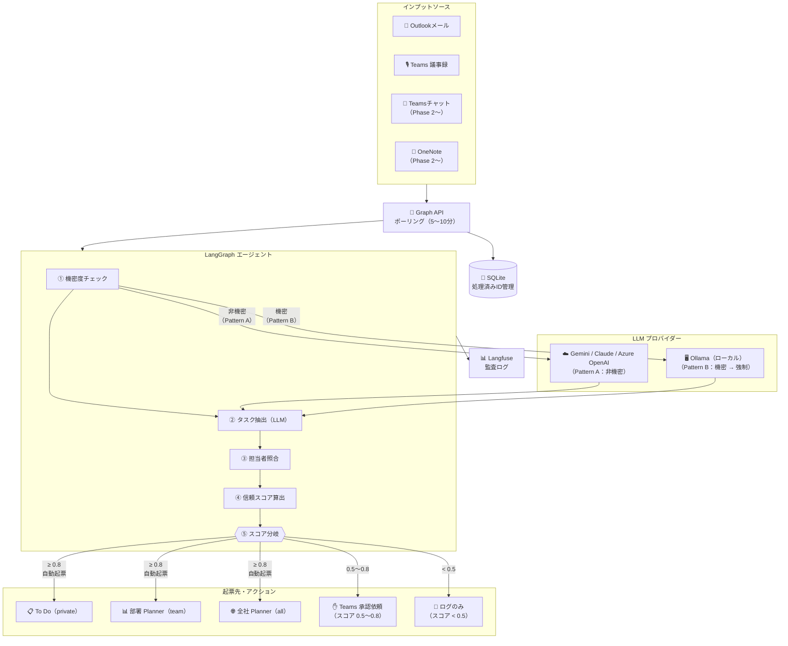
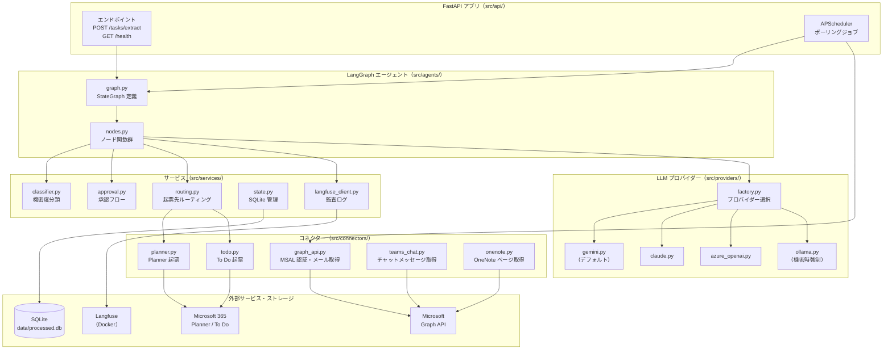
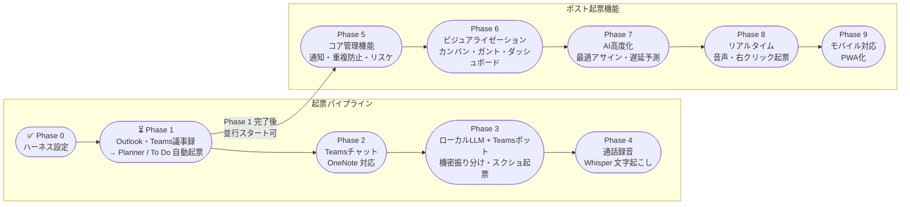

# AutoTicket — 自動タスク起票システム

Outlook メール・Teams 会議議事録・Teams チャット・OneNote から AI がタスクを自動抽出し、Microsoft Planner / To Do へ自動起票するシステムです。

---

## このシステムでできること

| インプット | 何が起きるか |
|-----------|------------|
| Outlookメール（未読） | AI がタスクを抽出して Planner / To Do へ自動起票 |
| Teams 会議議事録 | アクションアイテムを自動検出して起票 |
| Teams チャットメッセージ | チャンネルメッセージからタスクを抽出（Phase 2） |
| OneNote ページ | ページ内容からタスクを抽出（Phase 2） |
| Teams ボット（スクショ＋コメント） | 画像に書かれた内容を AI が読み取って起票（Phase 3） |
| 通話録音ファイル | 音声を文字起こし後にタスク抽出（Phase 4） |

---

## システムの動き方



起票先は抽出されたタスクの「公開範囲（visibility）」で自動決定されます：

| visibility | 起票先 |
|-----------|--------|
| `private` | 担当者個人の Microsoft To Do |
| `team` | 担当者が所属する部署の Planner |
| `all` | 全社共有 Planner |

---

## セキュリティの考え方

- **機密データは社外に送信しない**: 給与・評価・人事・医療情報などのキーワードが含まれる場合、社内ローカル AI（Ollama）のみで処理します
- **アクセス制限**: 処理対象ユーザーは IT 管理者が設定した範囲のみ（最初は担当者1名、段階的に拡大）
- **監査ログ**: 全 AI 呼び出し・信頼スコア・起票結果を Langfuse（社内 Docker）に記録

---

## ドキュメント一覧

| ドキュメント | 対象 | 内容 |
|------------|------|------|
| [docs/startup-guide.md](docs/startup-guide.md) | **エンジニア** | **起動手順・起動順序・トラブルシューティング** |
| [docs/requirements.md](docs/requirements.md) | 全員 | 機能要件・非機能要件・フェーズ構成 |
| [docs/design.md](docs/design.md) | エンジニア | システム構成・API仕様・コンポーネント一覧 |
| [docs/db-schema.md](docs/db-schema.md) | エンジニア | DB定義（テーブル構造） |
| [docs/graph-api-setup.md](docs/graph-api-setup.md) | **IT管理者** | Azure AD アプリ登録・アクセス制限の設定手順 |
| [docs/specs/system-design.md](docs/specs/system-design.md) | エンジニア | 詳細設計（Phase 5〜9 機能・マルチユーザー設計含む） |

---

## システム構成図

各モジュールの依存関係と役割を示します。



---

## フェーズ構成

| フェーズ | 内容 | 状態 |
|---------|------|------|
| Phase 0 | 開発環境・基盤整備 | ✅ 完了 |
| Phase 1 | Outlook・Teams議事録 → Planner 自動起票 | ⏳ 進行中（Graph API 申請待ち） |
| Phase 2 | Teams チャット・OneNote 対応 | コード完了・実接続待ち |
| Phase 3 | ローカル AI（Ollama）+ Teams ボット | 未着手 |
| Phase 4 | 通話録音（Whisper） | 未着手 |
| Phase 5〜9 | タスク管理機能・ビジュアル・AI高度化・モバイル | 未着手 |



---

## 環境構築（エンジニア向け）

詳細な起動手順・起動順序については **[docs/startup-guide.md](docs/startup-guide.md)** を参照してください。

### 前提条件

| ソフトウェア | バージョン | 用途 |
|------------|----------|------|
| Python | 3.11 以上 | バックエンド |
| Node.js | 18 以上 | フロントエンド |
| Docker Desktop | 最新版 | PostgreSQL・Langfuse |
| Git | 任意 | ソース管理 |

Azure AD アプリ登録は IT 管理者に [docs/graph-api-setup.md](docs/graph-api-setup.md) を提出して依頼してください（Graph API 連携が不要な場合はスキップ可）。

### 初回セットアップ（1 回だけ）

```bash
# 1. Python 仮想環境を作成・有効化
python -m venv .venv
.venv\Scripts\activate        # Windows PowerShell

# 2. 依存パッケージをインストール
pip install -e ".[dev]"

# 3. バックエンド環境変数を設定
copy .env.example .env
# .env を開いて必要な値を設定（最低限: DATABASE_URL, GOOGLE_API_KEY）

# 4. Docker コンテナを起動（PostgreSQL + Langfuse）
docker compose -f docker/docker-compose.yml up -d

# 5. DB マイグレーション
alembic upgrade head

# 6. フロントエンド依存パッケージをインストール
cd frontend
npm install
copy .env.example .env.local
# .env.local を開いて VITE_AZURE_TENANT_ID / VITE_AZURE_CLIENT_ID を設定
cd ..
```

### 開発コマンド

**バックエンド**

```bash
# サーバー起動
uvicorn src.api.main:app --reload --port 8000

# テスト実行（122 件）
pytest tests/ -v

# リント・フォーマット・型チェック
ruff check src/ tests/
ruff format src/ tests/
mypy src/
```

**フロントエンド**

```bash
cd frontend

npm run dev     # 開発サーバー起動（http://localhost:5173）
npm run build   # プロダクションビルド
npx tsc --noEmit  # 型チェックのみ
```

### 開発用バイパスモード（Azure AD なしでテスト）

Azure AD のテナント ID がない状態でも動作確認できるモードです。

**バックエンド `.env`** に追記:
```
DEV_MODE=true
```

**フロントエンド `frontend/.env.local`** に追記:
```
VITE_DEV_BYPASS_AUTH=true
```

設定後にサーバーを再起動すると、ブラウザで名前・ロールを入力してログインできます。本番環境では必ず `false` に戻してください。

---

## IT 管理者の方へ

**現在お願いしていること：**

1. [docs/graph-api-setup.md](docs/graph-api-setup.md) に従って Azure AD アプリ登録を実施
2. Exchange Application Access Policy を設定（最初は担当者1名のみ）
3. 完了後、テナントID / クライアントID / シークレット を担当者（shinsuke-imanaka@vorn.co.jp）にセキュアな方法で共有

---

## 技術スタック

| レイヤー | ツール |
|---------|--------|
| API フレームワーク | FastAPI + uvicorn |
| AI オーケストレーション | LangGraph |
| AI プロバイダー | Gemini（デフォルト）/ Claude / Azure OpenAI / Ollama |
| データモデル | Pydantic v2 |
| RDB | PostgreSQL 16（Docker） + SQLAlchemy 2.x async |
| マイグレーション | Alembic（非同期） |
| ローカル DB | SQLite（aiosqlite・処理済み ID 管理） |
| M365 連携 | Microsoft Graph API（MSAL） |
| 監査ログ | Langfuse（Docker） |
| フロントエンド | React 19 + TypeScript + Vite + Ant Design |
| 状態管理 | Zustand + TanStack Query |
| 認証 | MSAL（Azure AD Entra ID） |
| ローカル AI（Phase 3〜） | Ollama（qwen2.5:7b / llama3.2-vision） |
