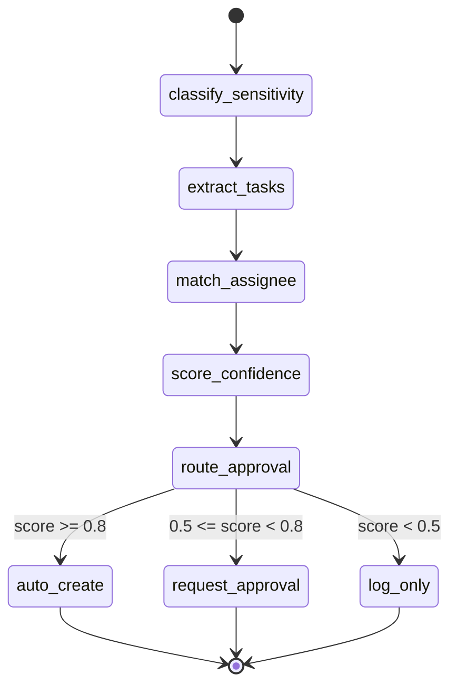

# AutoTicket — 基本設計書（概要版）

最終更新: 2026-05-18
フェーズ: Phase 1 実装中（Web アプリ化対応予定）
対象読者: バックエンドエンジニア

> ⚠️ **アーキテクチャ更新のお知らせ（2026-05-18）**
>
> 社内要件（37機能）の統合に伴い、以下の変更が決定しました。
>
> | 項目 | 変更前 | 変更後 |
> |------|--------|--------|
> | タスク保存先 | Microsoft Planner / To Do | **PostgreSQL** |
> | タスク閲覧 UI | Planner / To Do の画面 | **カスタム React SPA** |
> | 認証 | なし | **Entra ID（MSAL）** |
>
> **本ドキュメントは LangGraph 自動起票パイプライン（バックエンド）の設計を記載しています。**
> Web アプリ全体の設計（DB スキーマ・API・フロントエンド）は
> [`docs/specs/2026-05-18-dashboard-webapp-design.md`](specs/2026-05-18-dashboard-webapp-design.md) を参照してください。

---

## 1. システム構成図

```
┌─────────────────────────────────────────────────────────────┐
│  Microsoft 365 テナント                                       │
│                                                             │
│  ┌──────────────┐   ┌────────────────┐   ┌──────────────┐  │
│  │ Outlook メール│   │ Teams 会議文字 │   │  Planner /   │  │
│  │ (未読取得)   │   │ 起こし         │   │  To Do       │  │
│  └──────┬───────┘   └───────┬────────┘   └──────▲───────┘  │
│         │                   │                   │           │
│         └─────────┬─────────┘           起票 (Graph API)   │
│                   │ Graph API                   │           │
└───────────────────┼─────────────────────────────┼───────────┘
                    │                             │
                    ▼                             │
         ┌──────────────────┐                    │
         │  FastAPI + uvicorn│                    │
         │  (ポーリング:     │                    │
         │   APScheduler)   │                    │
         └────────┬─────────┘                    │
                  │                              │
                  ▼                              │
         ┌──────────────────┐                    │
         │  LangGraph        │────────────────────┘
         │  エージェント     │
         └────────┬─────────┘
                  │
         ┌────────┴─────────┐
         │                  │
         ▼                  ▼
  ┌─────────────┐   ┌───────────────┐
  │  SQLite     │   │   Langfuse    │
  │ processed.db│   │  (Docker)     │
  │ 処理済みID  │   │  監査ログ     │
  └─────────────┘   └───────────────┘
```

**LLMプロバイダー（.env の `LLM_PROVIDER` で切り替え）:**

```
LangGraph エージェント
    │
    ├─ Pattern A（非機密）→ Gemini（デフォルト）/ Claude / Azure OpenAI / Ollama（設定値で選択）
    └─ Pattern B（機密）  → Ollama のみ（強制・外部送信禁止、Phase 3 以降）
```

---

## 2. LangGraph 状態マシン

### 2-1. ノード一覧

| ノード名 | 処理内容 |
|---------|---------|
| `classify_sensitivity` | テキストをキーワードスキャンし Pattern A / B を判定 |
| `extract_tasks` | LLM にタスク抽出を依頼（タイトル・担当者・期限・優先度・visibility） |
| `match_assignee` | Graph API ユーザー一覧と照合してメールアドレスを解決 |
| `score_confidence` | 抽出結果の信頼スコア（0.0〜1.0）を算出 |
| `route_approval` | スコアで分岐：auto_create / request_approval / log_only |
| `auto_create` | Planner / To Do に直接起票 |
| `request_approval` | Teams Adaptive Card で承認依頼を送信 |
| `log_only` | Langfuse にログ記録のみ（起票しない） |

### 2-2. 状態遷移図（Mermaid）



### 2-3. LangGraph 状態スキーマ（Pydantic v2）

```python
class AgentState(BaseModel):
    raw_text: str
    source_type: str
    sensitivity: Literal["pattern_a", "pattern_b"]
    extracted_tasks: list[ExtractedTask]
    confidence_score: float
    route: Literal["auto_create", "request_approval", "log_only"]
    error: str | None = None
```

---

## 3. コンポーネント一覧

```
src/
├── api/
│   ├── main.py              — FastAPI アプリ初期化・APSchedulerポーリング起動
│   └── routers/
│       ├── tasks.py         — POST /tasks/extract エンドポイント
│       └── health.py        — GET /health エンドポイント
│
├── agents/
│   ├── graph.py             — LangGraph グラフ定義（ノード接続・エッジ条件）
│   └── nodes.py             — 各ノードの処理関数（classify・extract・score・route）
│
├── connectors/
│   ├── graph_api.py         — MSAL Client Credentials 認証・メール/文字起こし取得・ユーザー一覧取得
│   ├── planner.py           — Planner タスク起票（POST /planner/tasks）
│   └── todo.py              — To Do タスク起票（POST /me/todo/lists/{listId}/tasks）
│
├── models/
│   ├── task.py              — ExtractedTask・SensitivityResult・AgentState（Pydantic v2）
│   └── config.py            — Settings クラス（pydantic-settings、.env 読み込み）
│
├── providers/
│   ├── base.py              — LLMProvider Protocol 定義（インターフェース）
│   ├── ollama.py            — Ollama プロバイダー実装
│   ├── claude.py            — Claude API プロバイダー実装
│   ├── gemini.py            — Gemini API プロバイダー実装
│   ├── azure_openai.py      — Azure OpenAI プロバイダー実装
│   └── factory.py           — LLM_PROVIDER 設定値からプロバイダーを生成するファクトリー
│
└── services/
    ├── classifier.py        — 機密度分類ロジック（Pattern A/B 判定・キーワードリスト管理）
    ├── approval.py          — 信頼スコア→承認フロー分岐ロジック
    ├── routing.py           — visibility（private/team/all）→ 起票先ルーティング
    └── state.py             — SQLite 処理済みID 管理（aiosqlite: init_db / is_processed / mark_processed）
```

---

## 4. LLMプロバイダー切り替え設計

`.env` の `LLM_PROVIDER` 環境変数で実行時にプロバイダーを選択する。

### 4-1. Protocol 定義（`src/providers/base.py`）

```python
from typing import Protocol, runtime_checkable

@runtime_checkable
class LLMProvider(Protocol):
    async def complete(self, prompt: str) -> str: ...
    async def chat(self, messages: list[dict[str, str]]) -> str: ...
```

### 4-2. ファクトリー（`src/providers/factory.py`）

```python
def get_provider(settings: Settings) -> LLMProvider:
    match settings.llm_provider:
        case "ollama":       return OllamaProvider(settings)
        case "claude":       return ClaudeProvider(settings)
        case "gemini":       return GeminiProvider(settings)
        case "azure_openai": return AzureOpenAIProvider(settings)
        case _:
            raise ValueError(f"Unknown LLM_PROVIDER: {settings.llm_provider}")
```

### 4-3. 機密データ時のプロバイダー選択（`src/services/classifier.py`）

```python
def select_provider(sensitivity: str, settings: Settings) -> LLMProvider:
    if sensitivity == "pattern_b":
        # 機密データは Ollama を強制（外部LLM送信禁止）
        return OllamaProvider(settings)
    return get_provider(settings)
```

### 4-4. プロバイダー別設定値

| `LLM_PROVIDER` | 必須環境変数 | モデル例 |
|----------------|------------|---------|
| `gemini`（デフォルト） | `GOOGLE_API_KEY` | `gemini-2.0-flash` |
| `ollama` | `OLLAMA_HOST` | `qwen2.5:7b` |
| `claude` | `ANTHROPIC_API_KEY` | `claude-sonnet-4-6` |
| `azure_openai` | `AZURE_OPENAI_ENDPOINT`, `AZURE_OPENAI_API_KEY`, `AZURE_OPENAI_DEPLOYMENT` | `gpt-4o` |

---

## 5. 起票先ルーティングロジック

`src/services/routing.py` が visibility と担当者情報を受け取り、起票先コネクターを返す。

```
ExtractedTask.visibility
    │
    ├─ "private" → To Do（担当者個人の To Do リストに起票）
    │               connector: todo.py
    │               API: POST /users/{userId}/todo/lists/{listId}/tasks
    │
    ├─ "team"    → 部署 Planner（担当者の M365 Group に紐づく Plan に起票）
    │               connector: planner.py
    │               API: POST /planner/tasks（planId = M365 Group の既定 Plan）
    │
    └─ "all"     → 全社 Planner（PLANNER_ALL_PLAN_ID で指定した Plan に起票）
                    connector: planner.py
                    API: POST /planner/tasks（planId = PLANNER_ALL_PLAN_ID）
```

**担当者解決フロー:**  
`match_assignee` ノードが `ExtractedTask.assignee_name`（LLM 抽出の氏名文字列）を Graph API の `GET /users` で検索し、AAD オブジェクトID とメールアドレスを解決してから起票する。解決できない場合は `assignee_id = None` のまま起票し、信頼スコアを 0.5 以下に下げる。

---

## 6. セキュリティ設計

### 6-1. 機密度分類フロー

```
入力テキスト受信
    │
    ▼
classify_sensitivity ノード
    │
    ├─ キーワードリスト（classifier.py）でスキャン
    │   Pattern B キーワード例: 給与, 評価, 人事, 退職, 病気, 医療, 訴訟
    │
    ├─ Pattern B 検出 → select_provider() が OllamaProvider を強制返却
    │                    Ollama はローカル実行（外部送信なし）
    │                    Langfuse にパターンBフラグを記録
    │
    └─ Pattern A     → select_provider() が LLM_PROVIDER 設定値のプロバイダーを返却
```

### 6-2. 認証・シークレット管理

| 項目 | 方針 |
|------|------|
| Graph API 認証 | MSAL Client Credentials フロー（テナントID / クライアントID / クライアントシークレット） |
| シークレット保管 | `.env` ファイルのみ（`.gitignore` 除外済み）。CI/CD では環境変数で注入 |
| スコープ | 必要最小限（Phase 1: 4スコープ） |
| トークン | MSAL がキャッシュ・自動更新。コード内に生トークンを保持しない |

### 6-3. 監査ログ（Langfuse）

全LLM呼び出しで以下を記録する：

- 入力テキスト（機密度分類後、Pattern B は要約のみ）
- 使用プロバイダー名・モデル名
- 信頼スコア
- ルーティング結果（auto_create / request_approval / log_only）
- 起票先（To Do / Planner plan ID）

---

## 7. API仕様（Phase 1）

### GET /health

```
Request:  GET /health

Response: 200 OK
{
  "status": "ok"
}
```

### POST /tasks/extract

```
Request:  POST /tasks/extract
Query Params:
  text        : str  — 処理対象のテキスト本文
  source_type : str  — email | meeting | chat | onenote | teams_bot

Response: 200 OK
{
  "tasks": [
    {
      "title": "xxxxxx",
      "assignee_name": "山田 太郎",
      "assignee_id": "aad-object-id-or-null",
      "due_date": "2026-05-10",
      "priority": "high",
      "category": "開発",
      "visibility": "team",
      "confidence_score": 0.87,
      "route": "auto_create"
    }
  ]
}

Error: 422 Unprocessable Entity（バリデーションエラー）
Error: 500 Internal Server Error（LLM / Graph API 呼び出し失敗）
```

### POST /tasks/extract — Pydantic レスポンスモデル

```python
class ExtractedTask(BaseModel):
    title: str
    assignee_name: str
    assignee_id: str | None
    due_date: str | None          # ISO 8601 日付 例: "2026-05-10"
    priority: Literal["low", "medium", "high", "urgent"]
    category: str
    visibility: Literal["private", "team", "all"]
    confidence_score: float       # 0.0 〜 1.0
    route: Literal["auto_create", "request_approval", "log_only"]

class ExtractResponse(BaseModel):
    tasks: list[ExtractedTask]
```

---

## 8. 環境変数一覧

`.env.example` の主要変数。全変数は `src/models/config.py` の `Settings` クラスで定義する。

| 変数名 | 必須 | 説明 |
|--------|------|------|
| `AZURE_TENANT_ID` | 必須 | Azure AD テナントID |
| `AZURE_CLIENT_ID` | 必須 | アプリ登録のクライアントID |
| `AZURE_CLIENT_SECRET` | 必須 | アプリ登録のクライアントシークレット |
| `ALLOWED_USER_IDS` | 必須 | 処理対象ユーザーID（カンマ区切り）。空の場合は全ユーザーが対象になるため必ず設定 |
| `LLM_PROVIDER` | 必須 | `gemini`（デフォルト）/ `claude` / `azure_openai` / `ollama` |
| `LLM_VISION_PROVIDER` | 必須 | `gemini`（デフォルト）/ `claude` / `azure_openai` / `ollama` |
| `GOOGLE_API_KEY` | 条件付 | Gemini API キー（`LLM_PROVIDER=gemini` の場合） |
| `GEMINI_MODEL` | 任意 | Gemini モデル名（デフォルト: `gemini-2.0-flash`） |
| `ANTHROPIC_API_KEY` | 条件付 | Claude API キー（`LLM_PROVIDER=claude` の場合） |
| `AZURE_OPENAI_ENDPOINT` | 条件付 | Azure OpenAI エンドポイントURL（`LLM_PROVIDER=azure_openai` の場合） |
| `AZURE_OPENAI_API_KEY` | 条件付 | Azure OpenAI APIキー |
| `AZURE_OPENAI_DEPLOYMENT` | 条件付 | デプロイメント名（デフォルト: `gpt-4o`） |
| `OLLAMA_HOST` | 条件付 | Ollama エンドポイント（デフォルト: `http://localhost:11434`） |
| `OLLAMA_MODEL` | 条件付 | Ollama モデル名（デフォルト: `qwen2.5:7b`） |
| `PLANNER_GROUP_ID` | 必須 | 全社 M365 Group ID |
| `PLANNER_PLAN_ID` | 必須 | デフォルト Planner プラン ID |
| `COMPANY_WIDE_PLAN_ID` | 必須 | 全社共通 Planner の Plan ID |
| `DEPT_PLAN_MAP` | 必須 | 部署グループID→プランID マッピング（JSON形式、例: `{"group-id": "plan-id"}`） |
| `LANGFUSE_PUBLIC_KEY` | 必須 | Langfuse パブリックキー |
| `LANGFUSE_SECRET_KEY` | 必須 | Langfuse シークレットキー |
| `LANGFUSE_HOST` | 必須 | Langfuse ホスト（デフォルト: `http://localhost:3000`） |
| `POLLING_INTERVAL_SECONDS` | 任意 | ポーリング間隔（デフォルト: `300`） |
| `AUTO_CREATE_THRESHOLD` | 任意 | 自動起票スコア閾値（デフォルト: `0.8`） |
| `MANUAL_REVIEW_THRESHOLD` | 任意 | 承認依頼スコア閾値（デフォルト: `0.5`） |

---

## 9. 開発・実行コマンド

```bash
# 開発サーバー起動
uvicorn src.api.main:app --reload --port 8000

# テスト実行
pytest tests/ -v

# リント
ruff check src/ tests/

# フォーマット
ruff format src/ tests/

# 型チェック
mypy src/

# Langfuse・n8n 起動（Docker）
docker compose -f docker/docker-compose.yml up -d
```

---

## 10. ディレクトリ構造（全体）

```
AutoTicket/
├── CLAUDE.md
├── pyproject.toml
├── .env.example
├── .gitignore
├── .claude/
│   ├── settings.json
│   └── skills/
├── docs/
│   ├── requirements.md        — 要件定義書（本ファイルと同階層）
│   ├── db-schema.md           — DB定義書
│   ├── design.md              — 基本設計書（本ファイル）
│   ├── graph-api-setup.md     — IT管理者向けGraph API申請手順
│   ├── progress.md            — 進捗ログ
│   ├── tasks.md               — タスク一覧
│   └── superpowers/specs/     — 詳細設計ドキュメント群
├── src/
│   ├── api/
│   ├── agents/
│   ├── connectors/
│   ├── models/
│   ├── providers/
│   └── services/
├── tests/
│   ├── unit/
│   └── integration/
├── docker/
│   ├── docker-compose.yml
│   └── Dockerfile
└── data/                      # .gitignore 除外
    └── processed.db
```
